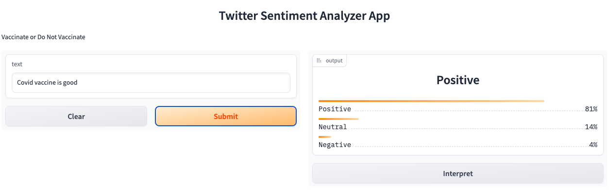

# NLP-Sentiment-Analysis-and-Deployment
This repository contains all the necessary code, data, and instructions for running the project on your own machine, and is intended for anyone interested in learning about NLP, Sentiment Analysis, and deploying machine learning models.

Sentiment analysis is the process of determining the sentiment or opinion expressed in a piece of text. In this project, we aim to build a sentiment analysis model using NLP techniques and deploy it as an application for real-time sentiment analysis of text data.

## Summary

| Name                       | Description        |
| -------------------------- | ------------------ | 
| Code                       | LP5                | 
| Project Name               | Natural Language Processing Project : Sentiment Analysis | 
| Published Article          | https://medium.com/@kwabenaabrefa/nlp-sentiment-analysis-and-deployment-610dc02254ad  |
| Deployed Ap                | https://huggingface.co/spaces/KwabenaMufasa/Tweets_Sentiment_Analyzer_App    |
|                            |                    | 

## Project Description
The "Tweets Sentiment Analyzer App" is a gradio online application that employs Huggingface pre-trained models to classify the sentiment of tweets about Covid-19 vaccinations. The software allows users to enter a keyword or phrase linked to Covid-19 vaccinations and provides real-time sentiment analysis of the resulting tweets. DistilBERT is the model utilized in the app. The program also provides a visualization of the findings of the analysis, allowing users to readily view the distribution of favorable, negative, and neutral tweets about Covid-19 vaccinations.

## Setup
----

For manual installation, you need to have Python3 on your system. Then you can clone this repo and being at the repo's root :: friendly_web_interface_for_ML_models> ... follow the steps below:

Windows:

      python -m venv venv; venv\Scripts\activate; python -m pip install -q --upgrade pip; python -m pip install -qr requirements.txt

Linux & MacOs:

      python3 -m venv venv; source venv/bin/activate; python -m pip install -q --upgrade pip; python -m pip install -qr requirements.txt

NB: For MacOs users, please install Xcode if you have an issue.

## App Execution

To execute the sentiment analysis application, follow these steps:

Make sure the required dependencies are installed.

Run the deployment script:

bash
Copy code
python app.py
Access the application through a web browser using the provided URL.

Enter the text you want to analyze for sentiment and submit the form.

Click the 'Analyze' button to get the predicted sentiment of the text

The application will process the input text and provide the sentiment analysis result.

## Author
----
FOSTER NANA KWABENA ABREFA

